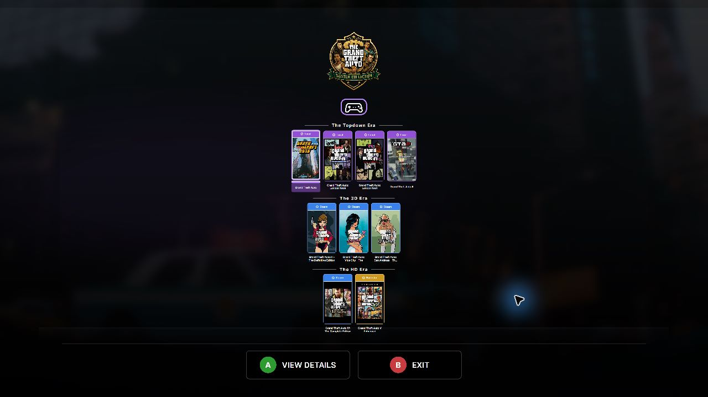

<div align="center">


# Cart Launch Companion

### Your game library, built for the couch.

A portable, fullscreen, controller-first launcher for Windows, Linux, and SteamOS.

<br>

[](https://github.com/Uplinkpro/CartLaunchCompanion/releases)
[](https://github.com/Uplinkpro/CartLaunchCompanion/actions/workflows/avalonia-ci.yml)
[](#quick-start)
[](#quick-start)
[](#display-support)
[](LICENSE)

<br>

[**Download 2.2**](https://github.com/Uplinkpro/CartLaunchCompanion/releases/tag/v2.2.0)
&nbsp;&nbsp;•&nbsp;&nbsp;
[Quick start](#quick-start)
&nbsp;&nbsp;•&nbsp;&nbsp;
[Game Configurator](#game-configurator)
&nbsp;&nbsp;•&nbsp;&nbsp;
[Documentation](#documentation)
&nbsp;&nbsp;•&nbsp;&nbsp;
[Report an issue](https://github.com/Uplinkpro/CartLaunchCompanion/issues/new)

</div>

---

## One library. Every launcher. No desktop clutter.

Cart Launch Companion turns a curated collection of PC games into a focused console-style experience. Browse with a controller, view artwork and trailers, and launch Steam titles, storefront games, local executables, Wine, Proton, Heroic, and Flatpak targets without navigating a traditional desktop.

Everything stays together in one portable folder: the application, game configurations, artwork, media, cache, and logs. Move it to another drive, a living-room PC, or a handheld without rebuilding the library from scratch.

> **Current release:** [Version 2.2](https://github.com/Uplinkpro/CartLaunchCompanion/releases/tag/v2.2.0) is available for Windows, Linux, and SteamOS from the stable `main` branch.

## Preview

| Game library | Game details |
|---|---|
|  |  |
| **Game Configurator** | **Custom Series Collection** |
|  |  |

## Highlights

<table>
<tr>
<td width="50%" valign="top">

### 🎮 Controller-first by design

- Complete controller navigation
- Automatic focus and input switching
- Keyboard, mouse, and media-remote support
- Clear prompts that match the active device
- Steam Deck-friendly presentation

</td>
<td width="50%" valign="top">

### 🖥️ A true console-style interface

- Fullscreen borderless Avalonia UI
- Dynamic storefront branding
- Animated game selection and rich detail pages
- Responsive 720p, 1080p, 1440p, and 4K layouts
- OLED-friendly true-black presentation

</td>
</tr>
<tr>
<td width="50%" valign="top">

### 🎬 Artwork, screenshots, and trailers

- Local and online artwork sources
- 16:9 and 4:3 screenshot presentation
- Steam, YouTube, direct URL, and local video support
- Native LibVLC playback
- Automatic screenshot fallback when video is unavailable

</td>
<td width="50%" valign="top">

### 🗂️ Metadata without busywork

- Steam-first game information
- SteamGridDB artwork fallback
- Delisted-game lookup through PCGamingWiki
- Wikipedia description fallback
- Steam Deck and gamepad-support badges

</td>
</tr>
<tr>
<td width="50%" valign="top">

### 🚀 Flexible game launching

- Major PC storefronts and launcher URIs
- Direct executable and custom-command support
- Fullscreen emulator launching for curated retro collections
- Heroic, Flatpak, Wine, and Proton
- Process monitoring and launcher restoration
- Optional pre-launch companion applications

</td>
<td width="50%" valign="top">

### 📦 Portable and self-contained

- No traditional installer required
- Bundled platform-specific .NET runtime
- Relative paths for games and helper tools
- Portable artwork, media, logs, and cache
- Separate Windows, Linux, and combined packages

</td>
</tr>
<tr>
<td width="50%" valign="top">

### 🏆 Custom Series Collections

- Turn a curated series or genre into its own launcher
- Custom collection name, logo, description, and accent color
- Organize games into eras, generations, or themed shelves
- Automatic shelf ordering and responsive presentation
- Empty shelves remain hidden

</td>
<td width="50%" valign="top">

### ✨ Smooth living-room startup

- Animated library preparation screen
- No false empty-library flash during discovery
- Collection artwork and game metadata load together
- Full keyboard, controller, and remote navigation

</td>
</tr>
</table>

## Download

Download [Cart Launch Companion 2.2](https://github.com/Uplinkpro/CartLaunchCompanion/releases/tag/v2.2.0), or browse [all GitHub releases](https://github.com/Uplinkpro/CartLaunchCompanion/releases).

Version 2.2 provides three packages:

| Package | Intended use |
|---|---|
| `CartLaunchCompanion-2.2.0-win-x64.zip` | Windows-only portable installation |
| `CartLaunchCompanion-2.2.0-linux-x64.tar.gz` | Linux or SteamOS portable installation |
| `CartLaunchCompanion-2.2.0-portable.zip` | Combined Windows and Linux installation |

Every package is self-contained. The correct .NET runtime is included, so end users do not need to install the .NET SDK or runtime. Published archives contain no source, test, or build folders. Verify downloads with the included `SHA256SUMS.txt`.

## Supported launch methods

| Platform or method | Windows | Linux / SteamOS | Configuration |
|---|:---:|:---:|---|
| Steam | ✅ | ✅ | Steam App ID |
| Xbox / Microsoft Store | ✅ | — | Xbox application ID or URI |
| Epic Games | ✅ | Via Heroic | Epic application name or Heroic game ID |
| GOG | ✅ | Via Heroic or Wine | Executable, URI, or Heroic game ID |
| Ubisoft Connect | ✅ | Via Wine | Ubisoft game ID or URI |
| Rockstar Games Launcher | ✅ | Via Wine | Executable, game ID, or URI |
| Amazon Games | ✅ | Via Wine | Executable, game ID, or URI |
| Heroic Games Launcher | — | ✅ | Heroic game ID or URI |
| Flatpak | — | ✅ | Flatpak application ID |
| Wine | — | ✅ | Windows executable and optional prefix |
| Proton | — | ✅ | Steam App ID or direct Proton executable |
| Local executable | ✅ | ✅ | Executable and optional arguments |
| Custom URI or command | ✅ | ✅ | Platform-specific URI or executable |

## Requirements

### Running a portable release

- A 64-bit Windows, Linux, or SteamOS system.
- A writable extraction folder for configurations, cache, and logs.
- The relevant storefront client for launcher-managed games.
- Internet access for online metadata, artwork, and trailers; local games and media continue to work offline.
- A controller is recommended but not required.

The portable packages include the required .NET runtime. No installer, SDK, or system-wide runtime is needed.

## Quick start

### Windows

1. Download and extract the Windows or combined portable package.
2. Run **Start Cart Launch Companion.bat**.
3. Run **Game Configurator.bat** to create or edit game entries.

### Linux and SteamOS

1. Download and extract the Linux or combined portable package.
2. Allow the shell launchers to run if your archive tool did not preserve permissions:

   ```bash
   chmod +x "Start Cart Launch Companion.sh" "Game Configurator.sh"
   ```

3. Run `./Start Cart Launch Companion.sh`.
4. Run `./Game Configurator.sh` to create or edit game entries.

## Game Configurator

The included Game Configurator creates complete game folders without requiring users to edit JSON manually.

- Every option is labeled as required, optional, or advanced.
- Search Steam by title or exact App ID.
- Match legacy and delisted games through fallback metadata sources.
- Preview available artwork before saving.
- Configure Windows and Linux launch methods independently.
- Add an optional companion executable beside the primary executable.
- Assign games to Custom Series Collection shelves and control their order.
- See fullscreen CLI recipes for RetroArch, DuckStation, PCSX2, Dolphin, and RPCS3 directly in the launch form.
- Validate the complete configuration before writing `game.json`.
- Prepare configurations even when the game executable is not present yet.

Steam and SteamGridDB keys are optional and are stored in Windows Credential Manager or the Linux desktop keyring. They are never written into `game.json` or plaintext configurator settings. PCGamingWiki and Wikipedia fallbacks require no user credentials.

See the [Game Configurator guide](Documentation/Game-Configurator.md) for the complete workflow.

## Custom Series Collection launcher

Custom Series Collection mode turns one Cart Launch Companion installation into a focused launcher for a franchise, genre, platform, or personal theme. For example, one portable cart can become **The Grand Theft Auto Master Collection**, with separate shelves for the Topdown, 3D, and HD eras.

Collection mode is optional. Without `Config/collection.json`, Cart Launch Companion continues to use its normal mixed-library presentation.

### 1. Add the collection definition

Copy [`Config/collection.example.json`](Config/collection.example.json) to `Config/collection.json`, then edit it:

```json
{
  "$schema": "../Schemas/collection.schema.json",
  "formatVersion": 1,
  "enabled": true,
  "name": "The Grand Theft Auto Master Collection",
  "description": "Every era of Grand Theft Auto in one cart.",
  "logo": "Assets/Collections/GrandTheftAuto/Logo.png",
  "accentColor": "#F2C94C",
  "defaultShelf": "",
  "shelves": [
    { "name": "The Topdown Era", "order": 10 },
    { "name": "The 3D Era", "order": 20 },
    { "name": "The HD Era", "order": 30 }
  ]
}
```

| Setting | Required | Purpose |
|---|:---:|---|
| `enabled` | Yes | Turns Custom Series Collection mode on or off. |
| `name` | Yes | Names the complete collection. It is used when no logo is available. |
| `description` | No | Short internal description of the collection. |
| `logo` | No | Portable path to a transparent collection logo. PNG is recommended. |
| `accentColor` | Yes | Hex color used for collection accents. |
| `defaultShelf` | No | Shelf for games without an assigned shelf. Leave blank for no heading. |
| `shelves` | No | Defines shelf names and their display order. Only shelves containing games are shown. |

Collection artwork belongs under `Assets/Collections/<CollectionName>/`. Paths are relative to the Cart Launch Companion folder, so the collection remains portable.

### 2. Assign each game to a shelf

Add a `collection` object to each game's `game.json`:

```json
"collection": {
  "shelf": "The 3D Era",
  "order": 20
}
```

The shelf name must match the name in `collection.json`. `order` controls the game's position within that shelf; increments of 10 leave room to insert games later. A shelf is automatically hidden when no games use it.

### 3. Refresh the launcher

Restart Cart Launch Companion or press `F5`. The startup screen discovers the games, builds the populated shelves, loads the collection logo, and scales the complete collection to the available display.

For best results:

- use a transparent, wide or crest-shaped PNG for the collection logo;
- keep shelf names short enough to read from across the room;
- use consistent cover-art proportions across the collection;
- keep each collection intentionally curated so every game remains readable on a television or handheld.

## Portable folder layout

```text
CartLaunchCompanion/
├── Start Cart Launch Companion.bat
├── Start Cart Launch Companion.sh
├── Game Configurator.bat
├── Game Configurator.sh
├── Assets/
├── Config/
├── Games/
├── Logs/
├── Cache/
├── Schemas/
└── System/
    ├── Windows-x64/
    └── Linux-x64/
```

Platform-specific packages include only their matching `System` directory and launch scripts. The combined package includes both. `Games`, `Config`, `Logs`, and `Cache` must remain writable. The cache is disposable, and logs rotate automatically.

## Game folder layout

Each directory under `Games` is self-contained:

```text
Games/
└── Example Game/
    ├── game.json
    ├── Artwork/
    │   ├── Cover.jpg
    │   ├── Background.jpg
    │   ├── Logo.png
    │   └── Icon.png
    ├── Media/
    │   ├── Trailer.mp4
    │   └── Screenshots/
    ├── Game/
    │   └── PrimaryGame.exe
    └── Tools/
        └── CompanionApp.exe
```

Paths in `game.json` can be relative to the game folder, keeping configurations portable between computers and operating systems. The complete schema is available at [`Schemas/game.schema.json`](Schemas/game.schema.json), with working examples under [`Games/Examples`](Games/Examples).

## Metadata and artwork priority

Cart Launch Companion uses a predictable fallback order:

1. Local game-folder artwork and media.
2. Steam metadata, screenshots, and trailers.
3. SteamGridDB artwork when configured.
4. PCGamingWiki metadata matched by Steam App ID.
5. Wikipedia descriptions when other sources are incomplete.

Local files are never intentionally overwritten. Supported trailers include local video, Steam video sources, YouTube links, and direct video URLs. LibVLC handles playback and falls back visibly to screenshots when video is unavailable.

## Companion applications

Windows and Linux configurations can start one optional helper immediately before the game. Typical uses include:

- mod managers and script extenders;
- controller remappers and gamepad middleware;
- fan patches and compatibility tools;
- telemetry overlays or accessibility helpers.

The helper has independent executable, argument, and working-directory fields. It may remain running or close automatically after the monitored game process exits. If the primary game fails to launch, Cart Launch Companion closes the helper instead of leaving it orphaned.

## Emulators

The custom command backend can launch games directly through popular emulators without a separate integration layer. Cart Launch Companion supplies the emulator executable, fullscreen or batch flags, and the selected ROM or disc image, then restores the launcher when the emulator closes.

The [Emulator launch guide](Documentation/Emulator-Launch-Guide.md) includes portable Windows and Linux examples for:

- RetroArch;
- DuckStation;
- PCSX2;
- Dolphin;
- RPCS3.

The guide also covers shared emulator folders, quoted game paths, process monitoring, controller exit hotkeys, AppImages, and troubleshooting. Users must provide their own legally obtained firmware, BIOS files, keys, and game content.

## Controls

| Input | Action |
|---|---|
| D-pad, left stick, or arrow keys | Navigate |
| A or Enter | Open or launch |
| B or Escape | Go back or open Exit |
| X or Space | Pause or resume the trailer |

On-screen actions follow the active input device. The controller indicator dims when no controller is connected.

## Display support

The reference interface is composed at 1280×720 and scales uniformly to 1080p, 1440p, and 4K. Steam Deck's 1280×800 display uses true-black 40-pixel letterbox bands to preserve the 16:9 composition without distortion.

## Build from source

Building requires the [.NET 10 SDK](https://dotnet.microsoft.com/download/dotnet/10.0).

```powershell
dotnet build CartLaunchCompanion.Avalonia.sln -c Release
dotnet test Tests/CartLaunchCompanion.Core.Tests/CartLaunchCompanion.Core.Tests.csproj -c Release
dotnet test Tests/CartLaunchCompanion.Desktop.Tests/CartLaunchCompanion.Desktop.Tests.csproj -c Release
```

Run the launcher:

```powershell
dotnet run --project Source/CartLaunchCompanion.Desktop -c Release
```

Run the configurator:

```powershell
dotnet run --project Source/CartLaunchCompanion.Configurator -c Release
```

Create self-contained release packages:

```powershell
.\Publish-Portable.ps1
```

## Documentation

- [Game Configurator](Documentation/Game-Configurator.md)
- [Emulator launch guide](Documentation/Emulator-Launch-Guide.md)
- [Architecture](docs/2.0/Architecture.md)
- [Controller guide](docs/2.0/ControllerGuide.md)
- [Design principles](docs/2.0/DesignPrinciples.md)
- [Folder structure](docs/2.0/FolderStructure.md)
- [JSON specification](docs/2.0/JsonSpecification.md)
- [Theme guide](docs/2.0/ThemeGuide.md)
- [Version 1 upgrade guide](docs/2.0/UpgradeGuide.md)
- [Roadmap](docs/2.0/Roadmap.md)

## Reporting issues

Use [GitHub Issues](https://github.com/Uplinkpro/CartLaunchCompanion/issues) and include:

- operating system and version;
- display resolution;
- controller or input device;
- selected launch method;
- steps to reproduce;
- the relevant file from `Logs`, when available.

Remove usernames, private paths, account details, and API keys before sharing logs. Security concerns should follow the private process in [SECURITY.md](SECURITY.md).

## Contributing

Contributions are welcome. Read [CONTRIBUTING.md](CONTRIBUTING.md) before opening a pull request. Please keep platform parity, portable paths, controller navigation, and television readability in mind when proposing changes.

## Technology

Cart Launch Companion is built with:

- C# and .NET 10;
- Avalonia UI;
- CommunityToolkit.Mvvm;
- SDL3 controller input;
- LibVLCSharp video playback;
- Steam storefront services;
- SteamGridDB, PCGamingWiki, and Wikipedia metadata fallbacks.

## Project status

Version 2.2 is the current stable release. Reports are especially useful for:

- physical Steam Deck and SteamOS hardware;
- different controller models and hot-plug behavior;
- multiple-monitor and television setups;
- games that use intermediary launchers or child processes;
- Wine and Proton configurations outside Steam;
- storefront updates that change launch behavior.

See the [roadmap](docs/2.0/Roadmap.md) for planned work. Roadmap items are goals rather than release commitments.

## Acknowledgements

Thank you to the maintainers and communities behind .NET, Avalonia, SDL, VideoLAN, LibVLCSharp, SteamGridDB, PCGamingWiki, and Wikipedia—and to everyone who tests Cart Launch Companion, reports issues, and contributes improvements.

---

<div align="center">

## ☕ Support Cart Launch Companion

If Cart Launch Companion improves your gaming setup, you can support continued development, testing, documentation, and new launcher integrations.

<br>

<a href="https://buymeacoffee.com/Uplinkpro">
  
</a>

<br><br>

<a href="https://buymeacoffee.com/Uplinkpro">
  
</a>

<br><br>

*Scan the QR code or use the button to support development through Buy Me a Coffee.*

</div>

---

## License and trademarks

Cart Launch Companion is **source-available for noncommercial use** under the [PolyForm Noncommercial License 1.0.0](LICENSE). It is not open source under the OSI definition because commercial use is restricted.

Commercial use, resale, paid distribution, monetized bundling, and commercial derivatives require a separate written license from Uplinkpro. See [Commercial Licensing](COMMERCIAL-LICENSE.md) and preserve the required attribution in [NOTICE](NOTICE).

Earlier releases and source revisions distributed under the MIT License remain governed by the license attached to those copies. The current license applies prospectively from the licensing-change revision onward.

The project is not affiliated with or endorsed by Valve, Microsoft, Rockstar Games, Ubisoft, Epic Games, GOG, Amazon, VideoLAN, PCGamingWiki, Wikipedia, SteamGridDB, or any other storefront, publisher, or metadata provider. Third-party artwork, names, logos, and trademarks belong to their respective owners.

---

<div align="center">

### Bring your PC game library to the couch.

[Download 2.2](https://github.com/Uplinkpro/CartLaunchCompanion/releases/tag/v2.2.0)
&nbsp;&nbsp;•&nbsp;&nbsp;
[Documentation](#documentation)
&nbsp;&nbsp;•&nbsp;&nbsp;
[Issues](https://github.com/Uplinkpro/CartLaunchCompanion/issues)
&nbsp;&nbsp;•&nbsp;&nbsp;
[Contributing](CONTRIBUTING.md)
&nbsp;&nbsp;•&nbsp;&nbsp;
[Security](SECURITY.md)

</div>
