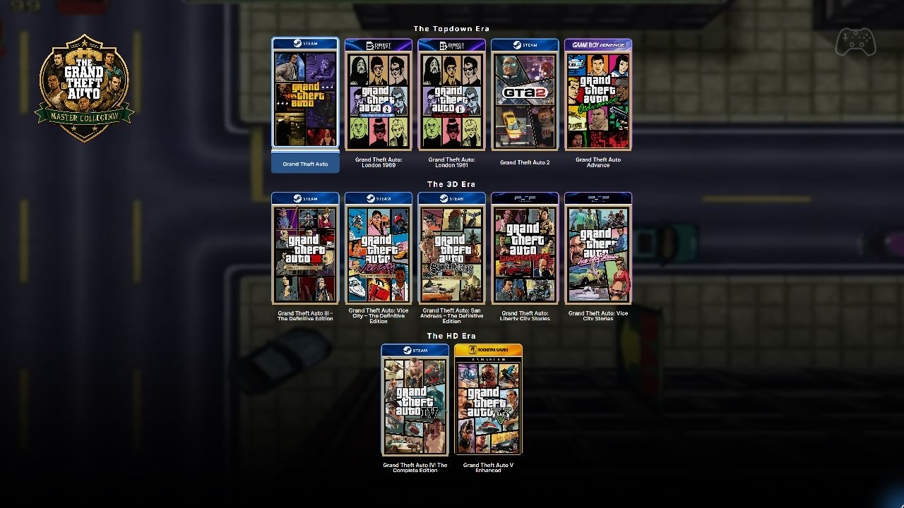
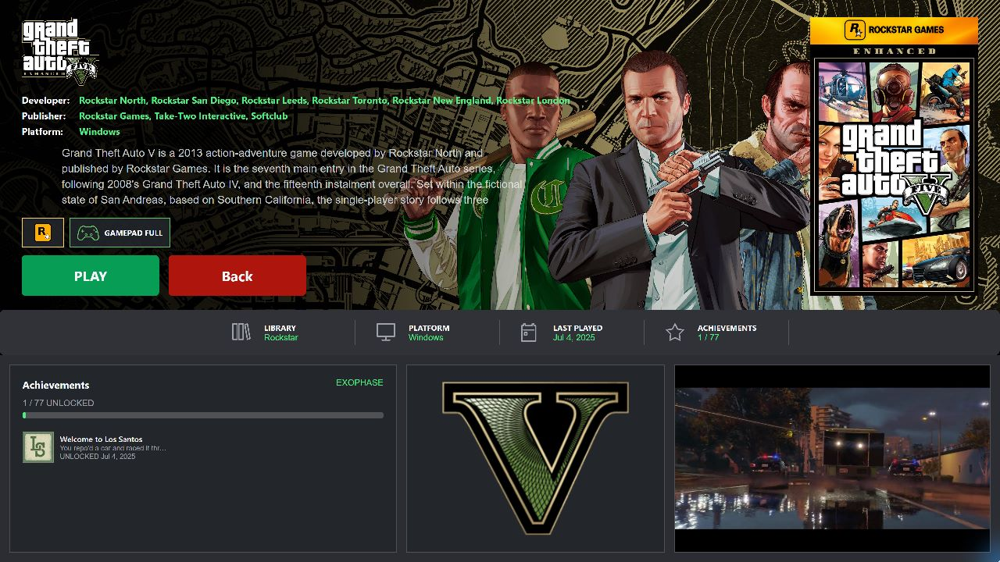
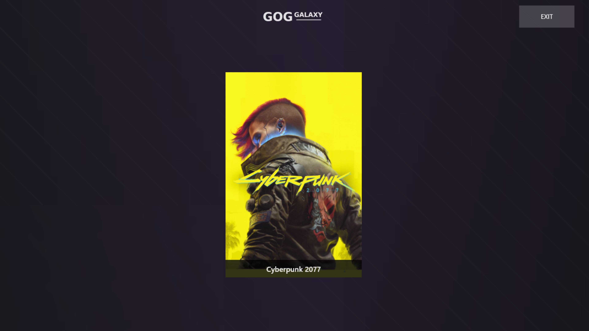

<div align="center">

# Cart Launch Companion

### A portable, fullscreen game launcher built for the couch.

Browse your PC game collection with a controller, view artwork and metadata, watch trailers, and launch games from multiple storefronts through one console-style interface.

<br>

[](#requirements)
[](#building-from-source)
[](#technology)
[](LICENSE)
[](https://github.com/YOUR-USERNAME/CartLaunchCompanion/releases/latest)

<br>

[Download Latest Release](https://github.com/YOUR-USERNAME/CartLaunchCompanion/releases/latest)
  •  
[Installation](#installation)
  •  
[Game Configuration](#game-configuration)
  •  
[Report an Issue](https://github.com/YOUR-USERNAME/CartLaunchCompanion/issues)

</div>

---

## Overview

**Cart Launch Companion** is a portable Windows launcher designed for gamepad-first use on televisions, gaming PCs, handhelds, and living-room setups.

It presents your installed games in a fullscreen library with cover artwork, launcher branding, metadata, trailers, and simple controller prompts. Games can be launched through supported storefront clients or directly from executable files.

The application is designed to remain self-contained. Configuration, artwork, cached metadata, logs, and launcher files can all live inside one portable directory.

---

## Screenshots

<div align="center">

### Game Library



<br><br>

### Game Details and Trailer



<br><br>

### Launcher Branding



</div>

---

## Highlights

<table>
<tr>
<td width="50%" valign="top">

### 🎮 Gamepad-First Navigation

Navigate the entire interface with an Xbox-compatible controller.

* D-pad and analog-stick navigation
* A button selection and launch
* B button back navigation
* Visible controller prompts
* Automatic focus management

</td>
<td width="50%" valign="top">

### 🖥️ Console-Style Interface

Built for fullscreen use from a couch or gaming setup.

* Large cover artwork
* Centered game library
* Dedicated metadata pages
* Dynamic launcher backgrounds
* Responsive WinUI 3 layout

</td>
</tr>

<tr>
<td width="50%" valign="top">

### 🎬 Integrated Trailers

Preview games without leaving the launcher.

* Local MP4 video support
* Steam trailer discovery
* Adaptive Steam video streams
* YouTube trailer support
* Native LibVLC playback

</td>
<td width="50%" valign="top">

### 📦 Portable Architecture

Keep the launcher and its data together.

* No traditional installer required
* Relative paths supported
* Portable game configuration
* Local artwork and videos
* Self-contained logs and cache

</td>
</tr>

<tr>
<td width="50%" valign="top">

### 🗂️ Rich Game Metadata

Display detailed information for each title.

* Descriptions
* Developers and publishers
* Genres
* Release dates
* Store pages
* Cover and header artwork

</td>
<td width="50%" valign="top">

### 🔄 Steam Metadata Overrides

Use Steam metadata for games launched elsewhere.

A Rockstar, Ubisoft, or directly launched game can use a Steam App ID for artwork, descriptions, trailers, and release information without changing its actual launch method.

</td>
</tr>
</table>

---

## Supported Launch Methods

| Launch method           |          Status          | Configuration                         |
| ----------------------- | :----------------------: | ------------------------------------- |
| Steam                   |             ✅            | `SteamID`                             |
| Rockstar Games Launcher |             ✅            | `RockstarGameId`                      |
| Ubisoft Connect         |             ✅            | `UbisoftGameId`                       |
| Direct executable       |             ✅            | `Executable` and optional `Arguments` |
| Custom URI or command   | Depends on configuration | Launcher-specific settings            |

Additional launcher integrations may be added over time.

---

## Installation

### Download a release

1. Open the [Releases](https://github.com/YOUR-USERNAME/CartLaunchCompanion/releases) page.
2. Download the latest portable ZIP.
3. Extract the entire archive to a writable folder.
4. Run the included launcher script or executable.

Example installation folder:

```text
C:\Games\CartLaunchCompanion
```

Avoid extracting the application into protected locations such as `C:\Program Files` unless it is configured with the necessary permissions.

---

## Portable Layout

```text
CartLaunchCompanion/
├── Assets/
│   └── Launchers/
├── Games/
│   └── Example Game/
│       ├── Game.json
│       ├── Cover.png
│       ├── Header.png
│       └── snaps.mp4
├── System/
│   ├── CartLaunchCompanion.exe
│   └── Data/
│       ├── Launcher.log
│       └── Startup.log
├── CartLaunchCompanion.cmd
└── Launch.ps1
```

The exact executable and script names may differ until the full project rename is completed.

---

## Game Configuration

Each game is stored in its own folder inside `Games`.

```text
Games/
└── Portal 2/
    ├── Game.json
    ├── Cover.png
    ├── Header.png
    └── snaps.mp4
```

Only `Game.json` is required. Artwork and video files are optional.

---

## Steam Game Example

```json
{
  "Name": "Portal 2",
  "Launcher": "Steam",
  "SteamID": "620",
  "ProcessName": "portal2",
  "RestoreOnExit": true
}
```

---

## Non-Steam Game with Steam Metadata

`SteamMetadataID` controls metadata only. It does not change the game’s launch provider.

```json
{
  "Name": "Example Ubisoft Game",
  "Launcher": "Ubisoft",
  "UbisoftGameId": "example-game-id",
  "SteamMetadataID": "123456",
  "ProcessName": "ExampleGame",
  "RestoreOnExit": true
}
```

This game still launches through Ubisoft Connect while using the specified Steam listing for:

* Description
* Developer and publisher
* Genres
* Release information
* Cover and header artwork
* Store page
* Trailers

---

## Direct Executable Example

```json
{
  "Name": "Example Portable Game",
  "Launcher": "DirectExe",
  "Executable": "Game\\ExampleGame.exe",
  "Arguments": "-fullscreen",
  "WorkingDirectory": "Game",
  "SteamMetadataID": "123456",
  "ProcessName": "ExampleGame",
  "RestoreOnExit": true
}
```

Paths can be configured relative to the portable launcher root.

---

## Configuration Reference

| Field                        | Purpose                                                    |
| ---------------------------- | ---------------------------------------------------------- |
| `Name`                       | Name displayed in the launcher                             |
| `Launcher`                   | Launch provider or launch method                           |
| `SteamID`                    | Steam App ID used to launch a Steam game                   |
| `SteamMetadataID`            | Steam App ID used only for metadata, artwork, and trailers |
| `RockstarGameId`             | Rockstar Games Launcher identifier                         |
| `UbisoftGameId`              | Ubisoft Connect game identifier                            |
| `Executable`                 | Executable used for direct launches                        |
| `Arguments`                  | Optional command-line arguments                            |
| `WorkingDirectory`           | Optional process working directory                         |
| `ProcessName`                | Process monitored to detect when the game exits            |
| `RestoreOnExit`              | Restores the launcher after the monitored game closes      |
| `ProcessStartTimeoutSeconds` | Maximum time to wait for the game process to appear        |
| `ProcessExitPollSeconds`     | Interval used when checking whether the game has exited    |
| `CoverImage`                 | Optional local library artwork                             |
| `HeaderImage`                | Optional local metadata-page artwork                       |
| `VideoFile`                  | Optional local trailer or gameplay video                   |
| `VideoUrl`                   | Optional direct video URL                                  |
| `YouTubeUrl`                 | Optional YouTube trailer                                   |
| `Description`                | Optional custom description                                |

Unknown or unused fields may be omitted.

---

## Artwork and Video

Local media can be placed inside each game folder.

| Filename     | Purpose                            |
| ------------ | ---------------------------------- |
| `Cover.png`  | Portrait or square library artwork |
| `Header.png` | Wide metadata-page artwork         |
| `snaps.mp4`  | Local trailer or gameplay preview  |

Configuration fields can be used when different filenames are preferred.

When `SteamMetadataID` or `SteamID` is available, the launcher can retrieve compatible artwork and trailer information from Steam.

---

## Trailer Selection

Available trailer sources include:

1. Local video files
2. Steam adaptive video streams
3. Steam-hosted trailer files
4. YouTube links
5. Direct video URLs

The exact selection order depends on the current configuration and available media.

Steam adaptive streams are rendered through a native LibVLC child window so playback remains contained inside the trailer panel.

---

## Controller Layout

| Input           | Action                        |
| --------------- | ----------------------------- |
| D-pad           | Navigate                      |
| Left stick      | Navigate                      |
| A               | Select or launch              |
| B               | Return to the previous screen |
| Keyboard arrows | Navigate                      |
| Enter           | Select                        |
| Escape          | Return                        |

Controller prompts are displayed on the game metadata page.

---

## Launcher Restoration

When configured with `RestoreOnExit`, Cart Launch Companion can:

1. Launch the selected game.
2. Stop active trailer playback.
3. Hide the launcher.
4. Detect the configured game process.
5. Wait for the game to close.
6. Show the launcher again.
7. Restore fullscreen mode and request foreground focus.

Reliable restoration depends on a correct `ProcessName`.

Example:

```json
{
  "ProcessName": "ExampleGame",
  "RestoreOnExit": true,
  "ProcessStartTimeoutSeconds": 30,
  "ProcessExitPollSeconds": 2
}
```

Use the process name without `.exe`.

---

## Logs and Troubleshooting

Runtime logs are stored in the portable data directory:

```text
System\Data\Launcher.log
System\Data\Startup.log
```

Include both files when opening a bug report related to:

* Startup failures
* Missing games
* Metadata loading
* Trailer playback
* Game launching
* Process detection
* Launcher restoration

### Common checks

* Confirm that `Game.json` contains valid JSON.
* Confirm that the configured executable exists.
* Confirm that launcher-specific IDs are correct.
* Confirm that `ProcessName` matches the running game process.
* Confirm that the application directory is writable.
* Confirm that required LibVLC runtime files are present.

---

## Requirements

### Running a release

* Windows 10 or Windows 11
* 64-bit Windows installation
* A supported game launcher for launcher-based games
* Internet access for online metadata and trailers
* Xbox-compatible controller optional

### Building from source

* Visual Studio with Windows application development components
* .NET 10 SDK
* Windows App SDK
* LibVLCSharp dependencies
* Compatible native LibVLC runtime

---

## Building from Source

Clone the repository:

```powershell
git clone https://github.com/YOUR-USERNAME/CartLaunchCompanion.git
cd CartLaunchCompanion
```

Restore dependencies:

```powershell
dotnet restore
```

Build:

```powershell
dotnet build
```

A project-specific publish script may also be provided:

```powershell
.\Publish-Portable.ps1
```

Build and publishing commands may need to be adjusted to match the final solution and project filenames.

---

## Technology

Cart Launch Companion is built with:

* C#
* .NET 10
* WinUI 3
* Windows App SDK
* LibVLCSharp
* WebView2
* Steam storefront metadata
* Native Win32 window integration

---

## Project Status

Cart Launch Companion is under active development.

Some features, launcher behaviors, and restoration workflows may vary between games and storefront clients. Testing reports are especially valuable for:

* Different controller models
* Multiple-monitor systems
* Storefront launcher updates
* Games with intermediary launchers
* Games that spawn child processes
* Fullscreen and exclusive-fullscreen titles

---

## Roadmap

Potential future improvements include:

* Playtime tracking
* Theme customization
* Controller remapping
* Automatic artwork management
* Metadata editing interface
* Emulator and ROM support

The roadmap is not a release commitment and may change as the project develops.

---

## Contributing

Bug reports, documentation improvements, feature proposals, and pull requests are welcome.

Before submitting a large change:

1. Search the existing issues.
2. Open a proposal describing the change.
3. Explain the intended behavior.
4. Include logs or screenshots when relevant.
5. Keep pull requests focused on one feature or fix.

Please avoid committing:

* Copyrighted game artwork without permission
* Store credentials
* Personal paths
* Generated build output
* Log files containing personal information

---

## Reporting Bugs

Open a [GitHub issue](https://github.com/YOUR-USERNAME/CartLaunchCompanion/issues/new) and include:

* Windows version
* Launcher version or commit
* Game launcher involved
* Relevant `Game.json`
* Steps to reproduce
* Expected behavior
* Actual behavior
* `Launcher.log`
* `Startup.log`
* Screenshots or video when useful

Remove usernames, account identifiers, and private paths before uploading logs.

---

## License

This project is distributed under the [MIT License](LICENSE).

Third-party libraries remain subject to their respective licenses.

Game names, storefront names, logos, artwork, videos, trademarks, and other third-party assets remain the property of their respective owners.

Cart Launch Companion is an independent project and is not affiliated with, endorsed by, or sponsored by Valve, Microsoft, Ubisoft, Rockstar Games, VideoLAN, or any other storefront or publisher.

---

## Acknowledgements

Cart Launch Companion uses or integrates with technologies and services from:

* Microsoft Windows App SDK
* .NET
* WinUI 3
* VideoLAN
* LibVLCSharp
* Microsoft Edge WebView2
* Steam storefront services

Thank you to everyone who tests the project, reports bugs, improves documentation, and contributes code.

---

<div align="center">

### Turn your Windows game library into a couch-friendly experience.

[Download](https://github.com/YOUR-USERNAME/CartLaunchCompanion/releases/latest)
  •  
[Documentation](#game-configuration)
  •  
[Issues](https://github.com/YOUR-USERNAME/CartLaunchCompanion/issues)

</div>
