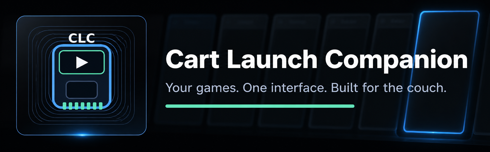
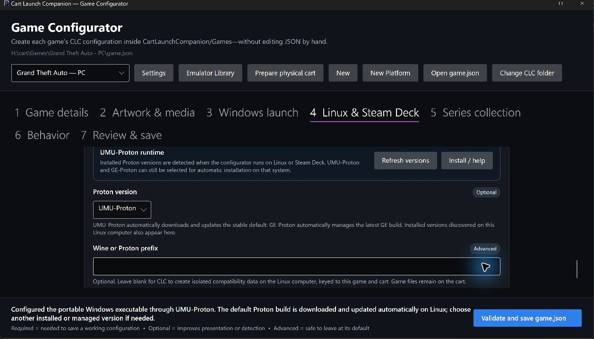
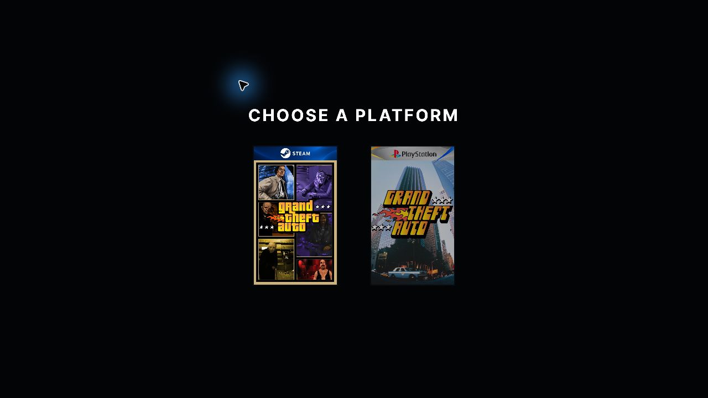

<div align="center">



# Cart Launch Companion

### Turn portable storage into a dedicated PC game cart.

A self-contained, fullscreen launcher for games and collections installed on the same portable drive.

<br>

[](https://github.com/Uplinkpro/CartLaunchCompanion/releases)
[](https://github.com/Uplinkpro/CartLaunchCompanion/actions/workflows/avalonia-ci.yml)
[](#quick-start)
[](#quick-start)
[](#display-support)
[](LICENSE)

<br>

[**Download latest release**](https://github.com/Uplinkpro/CartLaunchCompanion/releases/latest)
&nbsp;&nbsp;•&nbsp;&nbsp;
[Quick start](#quick-start)
&nbsp;&nbsp;•&nbsp;&nbsp;
[Game Configurator](#game-configurator)
&nbsp;&nbsp;•&nbsp;&nbsp;
[Trusted cart mode](#optional-trusted-insertion-and-automatic-launch)
&nbsp;&nbsp;•&nbsp;&nbsp;
[Documentation](#documentation)
&nbsp;&nbsp;•&nbsp;&nbsp;
[Report an issue](https://github.com/Uplinkpro/CartLaunchCompanion/issues/new)

</div>

---

## Give an old SSD a new life as a game cart

Cart Launch Companion (CLC) turns a portable SSD, USB drive, or other removable storage device into a dedicated PC game cart. Install one game, a complete series, or a small themed collection on the drive, then keep its launcher, configuration, artwork, media, emulators, and ROMs with it.

Plug the cart into a compatible Windows, Linux, or SteamOS device and CLC presents only the games that belong to that cart in a focused, controller-first interface. It can launch portable executables directly or hand a game to an installed storefront client, Wine, Proton, Heroic, Flatpak, or an emulator.

CLC is **not intended to replace Steam or organize every game installed across a computer**. Its purpose is smaller and more physical: recycle storage you already own into self-contained cartridges for dedicated games and thoughtfully curated collections.

> **The cart is the product.** CLC and its game definitions live in `Cart/`; installed game files live in the root-level `Games/` folder; shared emulators and game images can live in `Emulators/` and `Roms/`. Relative paths keep the cart usable when its drive letter or mount point changes.

> **Current release:** [Version 2.7.0](https://github.com/Uplinkpro/CartLaunchCompanion/releases/tag/v2.7.0) is available for Windows, Linux, and SteamOS. The optional CLC-Cart Monitor adds trusted removable-media detection, verified local staging, automatic launch, and safe ejection.

## Preview

| Cart home screen | Game details |
|---|---|
|  |  |
| **Game Configurator** | **Platform selection** |
|  |  |

## Highlights

<table>
<tr>
<td width="50%" valign="top">

### 🎮 Controller-first by design

- Complete controller navigation
- Automatic focus and input switching
- Keyboard, mouse, and media-remote support
- Clear prompts that match the active device
- Steam Deck-friendly presentation

</td>
<td width="50%" valign="top">

### 🖥️ A true console-style interface

- Fullscreen borderless Avalonia UI
- Dynamic storefront branding
- Animated game selection and rich detail pages
- Responsive 720p, 1080p, 1440p, and 4K layouts
- OLED-friendly true-black presentation

</td>
</tr>
<tr>
<td width="50%" valign="top">

### 🎬 Artwork, screenshots, and trailers

- Local and online artwork sources
- 16:9 and 4:3 screenshot presentation
- Steam, YouTube, direct URL, and local video support
- Native LibVLC playback
- Automatic screenshot fallback when video is unavailable

</td>
<td width="50%" valign="top">

### 🗂️ Metadata without busywork

- Steam-first game information
- SteamGridDB artwork fallback
- Delisted-game lookup through PCGamingWiki
- Wikipedia description fallback
- Steam Deck and gamepad-support badges

</td>
</tr>
<tr>
<td width="50%" valign="top">

### 🚀 Flexible game launching

- Major PC storefronts and launcher URIs
- Direct executable and custom-command support
- Fullscreen emulator launching for curated retro collections
- Heroic, Flatpak, Wine, and Proton
- Process monitoring and launcher restoration
- Optional pre-launch companion applications

</td>
<td width="50%" valign="top">

### 📦 Built to live on the cart

- No traditional installer required
- Bundled platform-specific .NET runtime
- Games, tools, and emulators use portable relative paths
- Portable artwork, media, logs, and cache
- Separate Windows, Linux, and combined packages

</td>
</tr>
<tr>
<td width="50%" valign="top">

### 🏆 Custom Series Collections

- Turn a curated series or genre into its own launcher
- Custom collection name, logo, description, and accent color
- Organize games into eras, generations, or themed shelves
- Automatic shelf ordering and responsive presentation
- Empty shelves remain hidden

</td>
<td width="50%" valign="top">

### ✨ Smooth living-room startup

- Animated library preparation screen
- No false empty-library flash during discovery
- Collection artwork and game metadata load together
- Full keyboard, controller, and remote navigation

</td>
</tr>
</table>

## Download

Download [Cart Launch Companion 2.7.0](https://github.com/Uplinkpro/CartLaunchCompanion/releases/tag/v2.7.0), or browse [all GitHub releases](https://github.com/Uplinkpro/CartLaunchCompanion/releases).

Version 2.7.0 provides three packages:

| Package | Intended use |
|---|---|
| `CartLaunchCompanion-2.7.0-win-x64.zip` | Windows-only cart runtime |
| `CartLaunchCompanion-2.7.0-linux-x64.tar.gz` | Linux or SteamOS cart runtime |
| `CartLaunchCompanion-2.7.0-portable.zip` | Combined Windows and Linux cart runtime |

Every package is self-contained. The correct .NET runtime is included, so end users do not need to install the .NET SDK or runtime. Published archives contain no source, test, or build folders. Verify downloads with the included `SHA256SUMS.txt`.

## Supported launch methods

| Platform or method | Windows | Linux / SteamOS | Configuration |
|---|:---:|:---:|---|
| Steam | ✅ | ✅ | Steam App ID |
| Xbox / Microsoft Store | ✅ | — | Xbox application ID or URI |
| Epic Games | ✅ | Via Heroic | Epic application name or Heroic game ID |
| GOG | ✅ | Via Heroic or Wine | Executable, URI, or Heroic game ID |
| Ubisoft Connect | ✅ | Via Wine | Ubisoft game ID or URI |
| Rockstar Games Launcher | ✅ | Via Wine | Executable, game ID, or URI |
| Amazon Games | ✅ | Via Wine | Executable, game ID, or URI |
| EA app | ✅ | Via Wine | Executable or complete launch URI |
| Battle.net | ✅ | Via Wine | Executable or complete launch URI |
| HoYoverse / HoYoPlay | ✅ | Via Wine | Executable or complete launch URI |
| itch.io | ✅ | ✅ | Executable and optional arguments |
| Flash | ✅ | ✅ | Portable player executable and game arguments |
| Heroic Games Launcher | — | ✅ | Heroic game ID or URI |
| Flatpak | — | ✅ | Flatpak application ID |
| Wine | — | ✅ | Windows executable and optional prefix |
| UMU-Proton | — | ✅ | Portable Windows executable; stable or GE-Proton version |
| Local executable | ✅ | ✅ | Executable and optional arguments |
| Custom URI or command | ✅ | ✅ | Platform-specific URI or executable |

For publisher-specific identifier formats, verified examples, and safer discovery methods, see the [Launcher ID and URI Guide](Documentation/Launcher-ID-Guide.md). The same guide is available inside the Game Configurator under **Windows launch → Launcher ID guide**. On Windows, **Find installed match** can scan local manifests, AUMIDs, and launcher shortcuts, then apply a user-confirmed match. The Windows launcher list is assembled from the folders under `System/Assets/Launchers`; adding or removing a supported launcher asset folder updates the Configurator list.

Portable Windows executables can be configured for Linux with **Fill from Windows**. CLC uses UMU Launcher rather than invoking Proton directly, offers automatically managed UMU-Proton and GE-Proton choices, and discovers installed Proton builds when the Configurator runs on Linux. The game stays on the cart; generated compatibility data is isolated in the Linux user's local CLC data folder by default because cross-platform removable filesystems do not reliably support every feature used by a Proton prefix.

When a game starts through an executable but still depends on Steam, Rockstar,
or another installed client, set **Required launcher and branding** in the
Configurator. CLC keeps the executable as the launch method, displays the
correct storefront branding, and starts the required client first when it is
not already running. Register portable Steam libraries once through Steam's
Storage settings; CLC deliberately does not edit storefront library databases.

## Requirements

### Running a game cart

- A 64-bit Windows, Linux, or SteamOS system.
- A writable portable storage device for CLC, its configuration, and its games.
- The relevant storefront client for launcher-managed games.
- Internet access for online metadata, artwork, and trailers; local games and media continue to work offline.
- A controller is recommended but not required.

The portable packages include the required .NET runtime. No installer, SDK, or system-wide runtime is needed.

## Quick start

Start with an empty or freshly prepared portable drive. The recommended root layout is:

```text
MyGameCart/
├── Cart/          # Cart Launch Companion, configuration, and artwork
├── Games/         # The installed PC game files carried by this cart
├── Emulators/     # Optional shared portable emulators
└── Roms/          # Optional ROMs and disc images
```

Extract the CLC release into `Cart/`, not directly into the root of the drive. Steam, Windows, or other launchers may create additional folders beside these; that is normal.

### Windows

1. Download the Windows or combined portable package and extract it into the cart's `Cart/` folder.
2. Run **Game Configurator.bat** to add the game files already stored on the cart.
3. Use the configurator's file locators so executable paths remain relative and survive drive-letter changes.
4. Run **Start Cart Launch Companion.bat**.

### Linux and SteamOS

1. Download the Linux or combined portable package and extract it into the cart's `Cart/` folder.
2. Allow the shell launchers to run if your archive tool did not preserve permissions:

   ```bash
   chmod +x "Start Cart Launch Companion.sh" "Game Configurator.sh"
   ```

3. Run `./Game Configurator.sh` to add games, emulators, and ROMs stored on the cart.
4. Run `./Start Cart Launch Companion.sh`.

## Game Configurator

The included Game Configurator creates complete game folders without requiring users to edit JSON manually.

- Every option is labeled as required, optional, or advanced.
- Search Steam by title or exact App ID.
- Match legacy and delisted games through fallback metadata sources.
- Preview available artwork before saving.
- Configure Windows and Linux launch methods independently.
- Add an optional companion executable beside the primary executable.
- Assign games to Custom Series Collection shelves and control their order.
- See fullscreen CLI recipes for RetroArch, DuckStation, PCSX2, Dolphin, and RPCS3 directly in the launch form.
- Validate the complete configuration before writing `game.json`.
- Prepare configurations even when the game executable is not present yet.

Steam and SteamGridDB keys are optional and are stored in Windows Credential Manager or the Linux desktop keyring. They are never written into `game.json` or plaintext configurator settings. PCGamingWiki and Wikipedia fallbacks require no user credentials.

See the [Game Configurator guide](Documentation/Game-Configurator.md) for the complete workflow.

## Optional trusted insertion and automatic launch

Every CLC installation is designed to live on a portable game cart. For a more console-like experience, an optional **CLC-Cart Monitor** on each computer can add trusted insertion detection, protected local staging, automatic launch, and safe eject.

Normal portable CLC use does not require CLC-Cart Monitor. Install it only on computers where you want the physical-cart workflow.

If the Monitor is already installed and a drive contains a published CLC runtime but no cart identity, insertion opens a **Set up this game cart?** review. The review lists every change, requires a cart name and explicit confirmation, creates only missing structure and identity files, then opens the separate trust review. Ordinary storage devices, incomplete `Cart` folders, and media with an invalid existing identity remain silent and are never repaired automatically.

### 1. Prepare the media

1. Format or empty the removable media as appropriate for the computers that will use it.
2. Open **Game Configurator** and choose **Prepare physical cart**.
3. Enter a friendly cart name and choose the media root—not a folder inside it.
4. Select **Create portable cart**. Existing `Games`, `Emulators`, and `Roms` folders are preserved; a non-empty existing `Cart` folder is never overwritten.
5. Review the readiness report. A cart is ready when its folders, identity, and at least one platform runtime pass verification.

The resulting media root contains:

```text
GameCart/
├── autorun.inf   # Hidden Windows-only drive icon and label; never executes software
├── .cartlaunch/   # Hidden CLC device identity and maintenance data
│   └── cartridge.json
├── Cart/          # CLC, Configurator, Cart Monitor, updater, configuration, and artwork
├── Games/         # Installed native game files, when kept on the cart
├── Emulators/     # Shared portable emulators
└── Roms/          # ROMs and disc images
```

Game definitions still live under `Cart/Games`. The root-level `Games` directory is for the actual game files. Steam or the operating system may add their own folders alongside these.
The `.cartlaunch` directory is hidden by its leading dot on Linux and SteamOS; CLC also applies the Windows hidden attribute when creating it. Hiding is only for a clean drive layout—the identity remains bounded and fully validated as untrusted data. On Windows, preparation also creates a hidden `autorun.inf` containing only the cart label and a reference to `Cart/System/Assets/AppIcon.ico`. It contains no command capable of launching software. Explorer may require the cart to be safely ejected and reinserted before a cached drive icon changes.

### 2. Install the optional CLC-Cart Monitor

When CLC detects that CLC-Cart Monitor is unavailable, it offers to open its installer. The installer shows every program, data, startup, trust, settings, and log location before making changes.

- **Current user** is recommended and does not require administrator access.
- **All Windows users** installs the Monitor for all users and requires the normal Windows administrator confirmation. Trust records and settings remain separate for each signed-in user.
- CLC-Cart Monitor does not install a service, driver, or system-wide Linux rule.
- Installation never trusts a cart or enables automatic launch.

Use **Install or repair** again whenever the local Monitor files need to be refreshed. Repair preserves trust records, settings, and logs.

### 3. Review and trust the cart

After preparation, choose **Review trust in Monitor**. CLC-Cart Monitor independently verifies the cart identity and complete CLC runtime inventory, then shows:

- the cart name and unique ID;
- its security version and connected-media path;
- each verified platform runtime and file count;
- the exact permission being stored for the signed-in user on that computer.

Immediately after trust or re-trust is approved, the Monitor asks whether that specific cart should launch automatically when inserted. Declining keeps manual launch available. Installing or repairing the Monitor registers the Monitor itself for sign-in startup, but never silently grants automatic launch to a cart.

Trust requires an explicit acknowledgment. It permits verified manual launch only. **Automatic launch remains off** until separately enabled for that individual cart. Trust can be revoked at any time from **Trusted carts** without changing files on the physical media.

### 4. Launch safely

For a manual launch, open **Connected carts**, select the cart, and choose **Verify and launch selected**. CLC-Cart Monitor checks the identity and every approved file, copies only the approved CLC runtime into a new user-only local session, verifies the copy again, and asks for one final launch confirmation.

CLC runs from that protected local session rather than directly from writable removable media. The cart is passed only as its data root, and the temporary local session is removed after CLC exits.

Automatic launch is a separate per-cart option under **Trusted carts**. When enabled, insertion follows the same identity, integrity, staging, and final-authorization checks. If the cart changes, disappears, is revoked, or fails verification, nothing launches.

### 5. Eject and remove the cart

While CLC is running as a trusted physical cart, choose its **Eject cart** action. CLC-Cart Monitor closes only that verified CLC process, removes its protected local session, flushes pending writes, and asks the operating system to eject the matching media. Wait for the success message before unplugging the drive.

If safe eject fails, close applications using the media and try again. Do not unplug the cart while configuration, artwork, game saves, or updates are being written.

### 6. Revoke trust or uninstall

- **Revoke selected** removes only the selected cart's local approval. It does not alter the cart.
- **Disable automatic launch** keeps manual trust but stops insertion-based launching.
- The **Uninstall** tab removes automatic startup and CLC-Cart Monitor only after explicit confirmation.
- Trust records, settings, and logs are optional removal choices. Connected carts are never modified by Monitor uninstall.

See [Security](SECURITY.md) for the threat model and [Physical Cart Hardware Test Checklist](Documentation/Physical-Cart-Hardware-Test-Checklist.md) before relying on a new drive or operating-system configuration.

## Custom Series Collection launcher

Custom Series Collection mode turns one physical cart into a focused launcher for a franchise, genre, platform, or personal theme. For example, a repurposed SSD can become **The Grand Theft Auto Master Collection**, with separate shelves for the Topdown, 3D, and HD eras.

Collection mode is optional. Without `Config/collection.json`, Cart Launch Companion uses its standard cart presentation.

### 1. Add the collection definition

Copy [`Config/collection.example.json`](Config/collection.example.json) to `Config/collection.json`, then edit it:

```json
{
  "$schema": "../Schemas/collection.schema.json",
  "formatVersion": 1,
  "enabled": true,
  "name": "The Grand Theft Auto Master Collection",
  "description": "Every era of Grand Theft Auto in one cart.",
  "logo": "Assets/Collections/GrandTheftAuto/Logo.png",
  "accentColor": "#F2C94C",
  "defaultShelf": "",
  "shelves": [
    { "name": "The Topdown Era", "order": 10 },
    { "name": "The 3D Era", "order": 20 },
    { "name": "The HD Era", "order": 30 }
  ]
}
```

| Setting | Required | Purpose |
|---|:---:|---|
| `enabled` | Yes | Turns Custom Series Collection mode on or off. |
| `name` | Yes | Names the complete collection. It is used when no logo is available. |
| `description` | No | Short internal description of the collection. |
| `logo` | No | Portable path to a transparent collection logo. PNG is recommended. |
| `accentColor` | Yes | Hex color used for collection accents. |
| `defaultShelf` | No | Shelf for games without an assigned shelf. Leave blank for no heading. |
| `shelves` | No | Defines shelf names and their display order. Only shelves containing games are shown. |

Collection artwork belongs under `Assets/Collections/<CollectionName>/`. Paths are relative to the Cart Launch Companion folder, so the collection remains portable.

### 2. Assign each game to a shelf

Add a `collection` object to each game's `game.json`:

```json
"collection": {
  "shelf": "The 3D Era",
  "order": 20
}
```

The shelf name must match the name in `collection.json`. `order` controls the game's position within that shelf; increments of 10 leave room to insert games later. A shelf is automatically hidden when no games use it.

### 3. Refresh the launcher

Restart Cart Launch Companion or press `F5`. The startup screen discovers the games, builds the populated shelves, loads the collection logo, and scales the complete collection to the available display.

For best results:

- use a transparent, wide or crest-shaped PNG for the collection logo;
- keep shelf names short enough to read from across the room;
- use consistent cover-art proportions across the collection;
- keep each collection intentionally curated so every game remains readable on a television or handheld.

## Portable folder layout

```text
CartLaunchCompanion/
├── Start Cart Launch Companion.bat
├── Start Cart Launch Companion.sh
├── Game Configurator.bat
├── Game Configurator.sh
├── Config/
├── Games/
├── Logs/
└── System/
    ├── Assets/
    ├── Cache/
    ├── CartMonitor/
    │   ├── Windows-x64/
    │   └── Linux-x64/
    ├── Schemas/
    ├── Windows-x64/
    └── Linux-x64/
```

Platform-specific packages include only their matching `System` directory and launch scripts. The combined package includes both. `Games`, `Config`, `Logs`, and `Cache` must remain writable. The cache is disposable, and logs rotate automatically.

Emulated games select platform branding through the Configurator's editable **Platform** field. Every folder under `System/Assets/Platforms` appears in the list. Folders use `Banner.png` above the cover and may provide an optional `Logo.png`; spaces and common abbreviations such as PS2, PSP, GBA, SNES, and GCN are normalized automatically.

## Game folder layout

Each directory under `Games` is self-contained:

```text
Games/
└── Example Game/
    ├── game.json
    ├── Artwork/
    │   ├── Cover.jpg
    │   ├── Background.jpg
    │   ├── Logo.png
    │   └── Icon.png
    ├── Media/
    │   ├── Trailer.mp4
    │   └── Screenshots/
    ├── Game/
    │   └── PrimaryGame.exe
    └── Tools/
        └── CompanionApp.exe
```

Paths in `game.json` can be relative to the game folder, keeping configurations portable between computers and operating systems. The complete schema is available at [`Schemas/game.schema.json`](Schemas/game.schema.json), with working examples under [`Games/Examples`](Games/Examples).

## Metadata and artwork priority

Cart Launch Companion uses a predictable fallback order:

1. Local game-folder artwork and media.
2. Steam metadata, screenshots, and trailers.
3. SteamGridDB artwork when configured.
4. PCGamingWiki metadata matched by Steam App ID.
5. Wikipedia descriptions when other sources are incomplete.

Local files are never intentionally overwritten. Supported trailers include local video, Steam video sources, YouTube links, and direct video URLs. LibVLC handles playback and falls back visibly to screenshots when video is unavailable.

## Companion applications

Windows and Linux configurations can start one optional helper immediately before the game. Typical uses include:

- mod managers and script extenders;
- controller remappers and gamepad middleware;
- fan patches and compatibility tools;
- telemetry overlays or accessibility helpers.

The helper has independent executable, argument, and working-directory fields. It may remain running or close automatically after the monitored game process exits. If the primary game fails to launch, Cart Launch Companion closes the helper instead of leaving it orphaned.

## Emulators

The custom command backend can launch games directly through popular emulators without a separate integration layer. Cart Launch Companion supplies the emulator executable, fullscreen or batch flags, and the selected ROM or disc image, then restores the launcher when the emulator closes.

The [Emulator launch guide](Documentation/Emulator-Launch-Guide.md) documents the generated Windows, Linux/AppImage, shared-data, and platform-ROM structure. Automatic executable recognition includes:

- RetroArch;
- DuckStation;
- PCSX2;
- Dolphin;
- RPCS3.
- PPSSPP, Vita3K, and shadPS4;
- Cemu, Azahar, melonDS, mGBA, Mesen, Snes9x, and Rosalie's Mupen GUI;
- xemu and Xenia;
- Flycast, MAME, DOSBox Staging, and ScummVM.

The guide also covers shared emulator folders, quoted game paths, process monitoring, controller exit hotkeys, AppImages, and troubleshooting. Users must provide their own legally obtained firmware, BIOS files, keys, and game content.

## Controls

| Input | Action |
|---|---|
| D-pad, left stick, or arrow keys | Navigate |
| A or Enter | Open or launch |
| B or Escape | Go back or open Exit |
| X or Space | Pause or resume the trailer |

On-screen actions follow the active input device. The controller indicator dims when no controller is connected.

## Display support

The reference interface is composed at 1280×720 and scales uniformly to 1080p, 1440p, and 4K. Steam Deck's 1280×800 display uses true-black 40-pixel letterbox bands to preserve the 16:9 composition without distortion.

## Build from source

Building requires the [.NET 10 SDK](https://dotnet.microsoft.com/download/dotnet/10.0).

```powershell
dotnet build CartLaunchCompanion.Avalonia.sln -c Release
dotnet test Tests/CartLaunchCompanion.Core.Tests/CartLaunchCompanion.Core.Tests.csproj -c Release
dotnet test Tests/CartLaunchCompanion.Desktop.Tests/CartLaunchCompanion.Desktop.Tests.csproj -c Release
```

Run the launcher:

```powershell
dotnet run --project Source/CartLaunchCompanion.Desktop -c Release
```

Run the configurator:

```powershell
dotnet run --project Source/CartLaunchCompanion.Configurator -c Release
```

Create self-contained release packages:

```powershell
.\Publish-Portable.ps1
```

## Documentation

- [Game Configurator](Documentation/Game-Configurator.md)
- [Updater security design](Documentation/Updater-Security.md)
- [Emulator launch guide](Documentation/Emulator-Launch-Guide.md)
- [Architecture](docs/2.0/Architecture.md)
- [Controller guide](docs/2.0/ControllerGuide.md)
- [Design principles](docs/2.0/DesignPrinciples.md)
- [Folder structure](docs/2.0/FolderStructure.md)
- [JSON specification](docs/2.0/JsonSpecification.md)
- [Theme guide](docs/2.0/ThemeGuide.md)

## Reporting issues

Use [GitHub Issues](https://github.com/Uplinkpro/CartLaunchCompanion/issues) and include:

- operating system and version;
- display resolution;
- controller or input device;
- selected launch method;
- steps to reproduce;
- the relevant file from `Logs`, when available.

Remove usernames, private paths, account details, and API keys before sharing logs. Security concerns should follow the private process in [SECURITY.md](SECURITY.md).

## Contributing

Contributions are welcome. Read [CONTRIBUTING.md](CONTRIBUTING.md) before opening a pull request. Please keep platform parity, portable paths, controller navigation, and television readability in mind when proposing changes.

## Technology

Cart Launch Companion is built with:

- C# and .NET 10;
- Avalonia UI;
- CommunityToolkit.Mvvm;
- SDL3 controller input;
- LibVLCSharp video playback;
- Steam storefront services;
- SteamGridDB, PCGamingWiki, and Wikipedia metadata fallbacks.

## Project status

Version 2.7.0 is the current stable release. Reports are especially useful for:

- physical Steam Deck and SteamOS hardware;
- different controller models and hot-plug behavior;
- multiple-monitor and television setups;
- games that use intermediary launchers or child processes;
- Wine and Proton configurations outside Steam;
- storefront updates that change launch behavior.

Development priorities are tracked through [GitHub issues](https://github.com/Uplinkpro/CartLaunchCompanion/issues) and release notes rather than a fixed roadmap.

## Acknowledgements

Thank you to the maintainers and communities behind .NET, Avalonia, SDL, VideoLAN, LibVLCSharp, SteamGridDB, PCGamingWiki, and Wikipedia—and to everyone who tests Cart Launch Companion, reports issues, and contributes improvements.

---

<div align="center">

## ☕ Support Cart Launch Companion

If Cart Launch Companion improves your gaming setup, you can support continued development, testing, documentation, and new launcher integrations.

<br>

<a href="https://buymeacoffee.com/Uplinkpro">
  
</a>

<br><br>

<a href="https://buymeacoffee.com/Uplinkpro">
  
</a>

<br><br>

*Scan the QR code or use the button to support development through Buy Me a Coffee.*

</div>

---

## License and trademarks

Cart Launch Companion is **source-available for noncommercial use** under the [PolyForm Noncommercial License 1.0.0](LICENSE). It is not open source under the OSI definition because commercial use is restricted.

Commercial use, resale, paid distribution, monetized bundling, and commercial derivatives require a separate written license from Uplinkpro. See [Commercial Licensing](COMMERCIAL-LICENSE.md) and preserve the required attribution in [NOTICE](NOTICE).

Earlier releases and source revisions distributed under the MIT License remain governed by the license attached to those copies. The current license applies prospectively from the licensing-change revision onward.

The project is not affiliated with or endorsed by Valve, Microsoft, Rockstar Games, Ubisoft, Epic Games, GOG, Amazon, VideoLAN, PCGamingWiki, Wikipedia, SteamGridDB, or any other storefront, publisher, or metadata provider. Third-party artwork, names, logos, and trademarks belong to their respective owners.

---

<div align="center">

### Recycle a drive. Build a collection. Plug in and play.

[Download 2.7.0](https://github.com/Uplinkpro/CartLaunchCompanion/releases/tag/v2.7.0)
&nbsp;&nbsp;•&nbsp;&nbsp;
[Documentation](#documentation)
&nbsp;&nbsp;•&nbsp;&nbsp;
[Issues](https://github.com/Uplinkpro/CartLaunchCompanion/issues)
&nbsp;&nbsp;•&nbsp;&nbsp;
[Contributing](CONTRIBUTING.md)
&nbsp;&nbsp;•&nbsp;&nbsp;
[Security](SECURITY.md)

</div>
